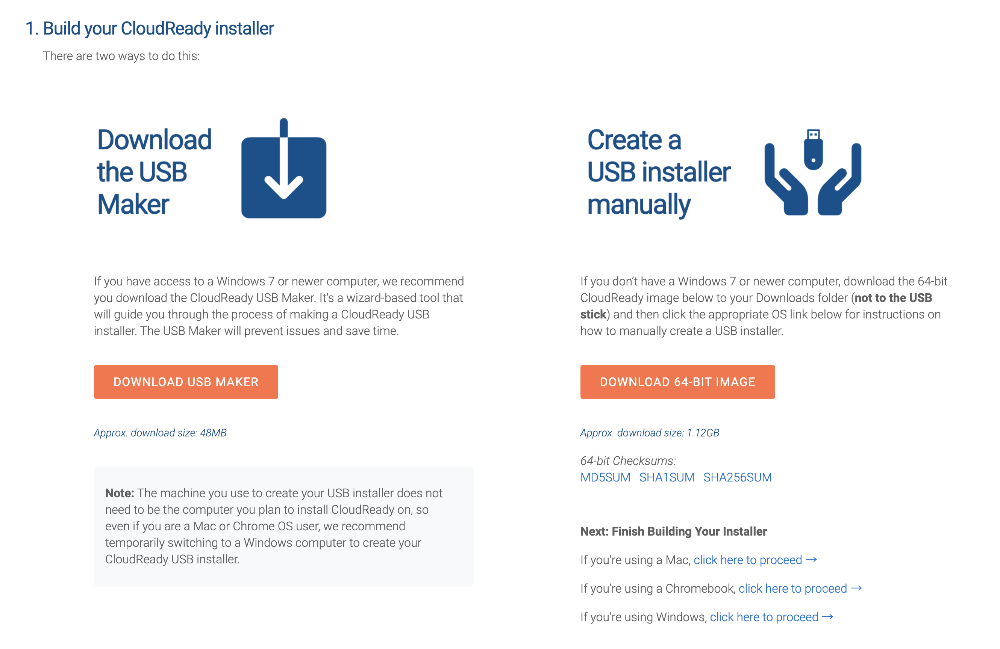
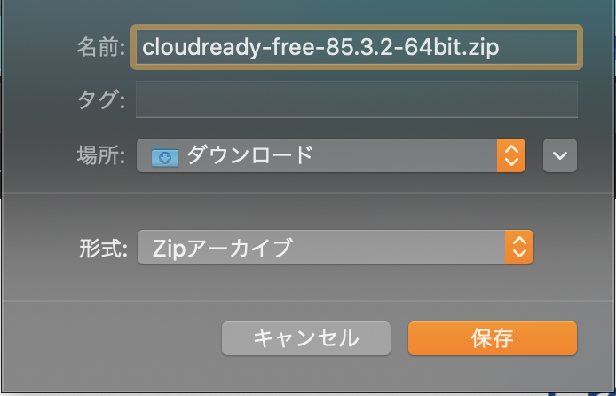
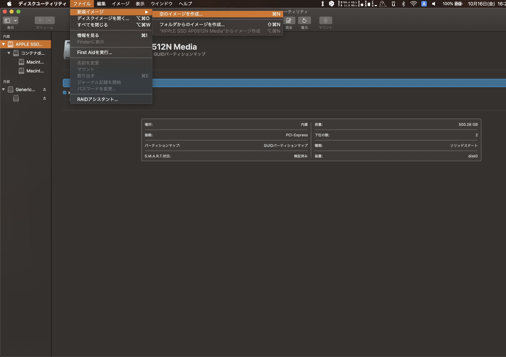
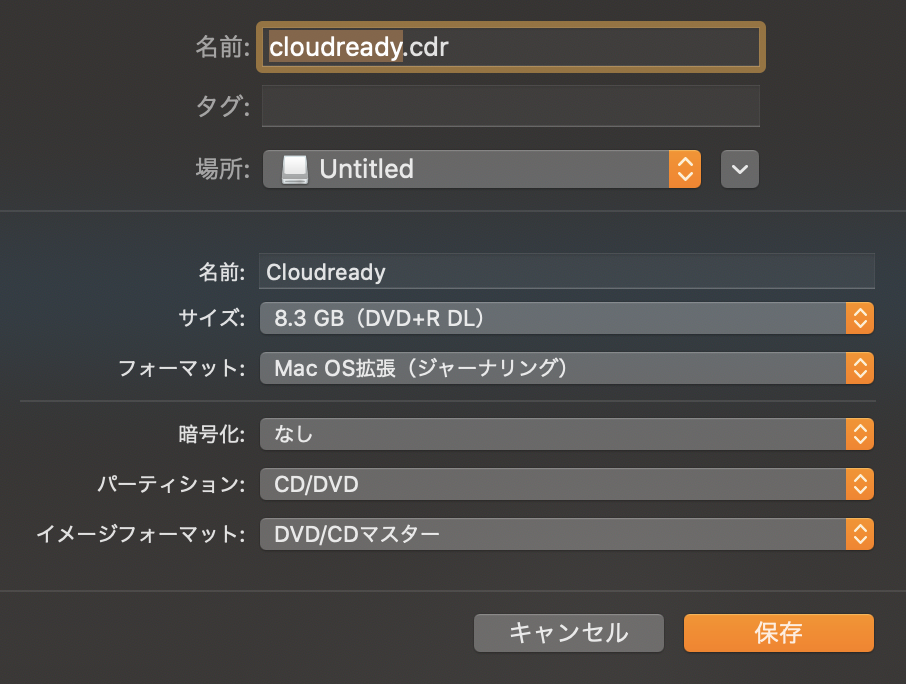
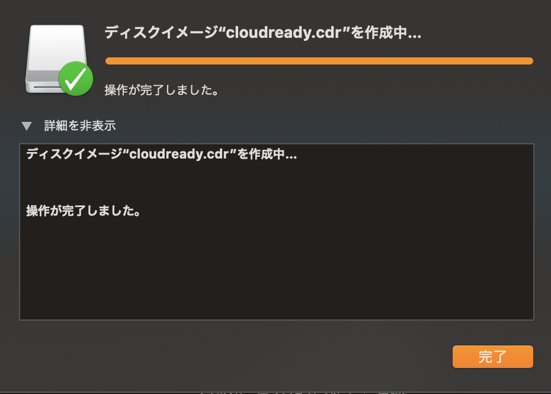
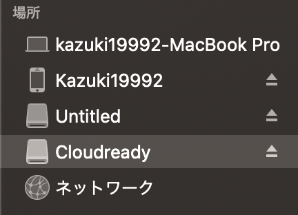
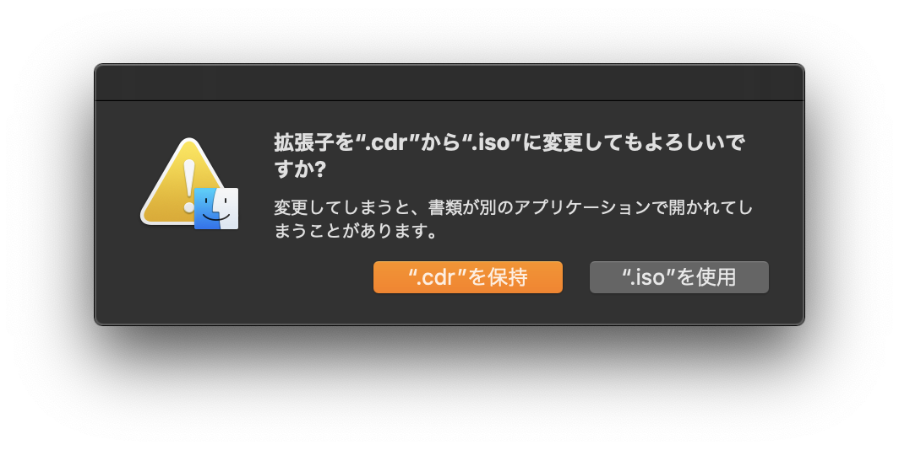
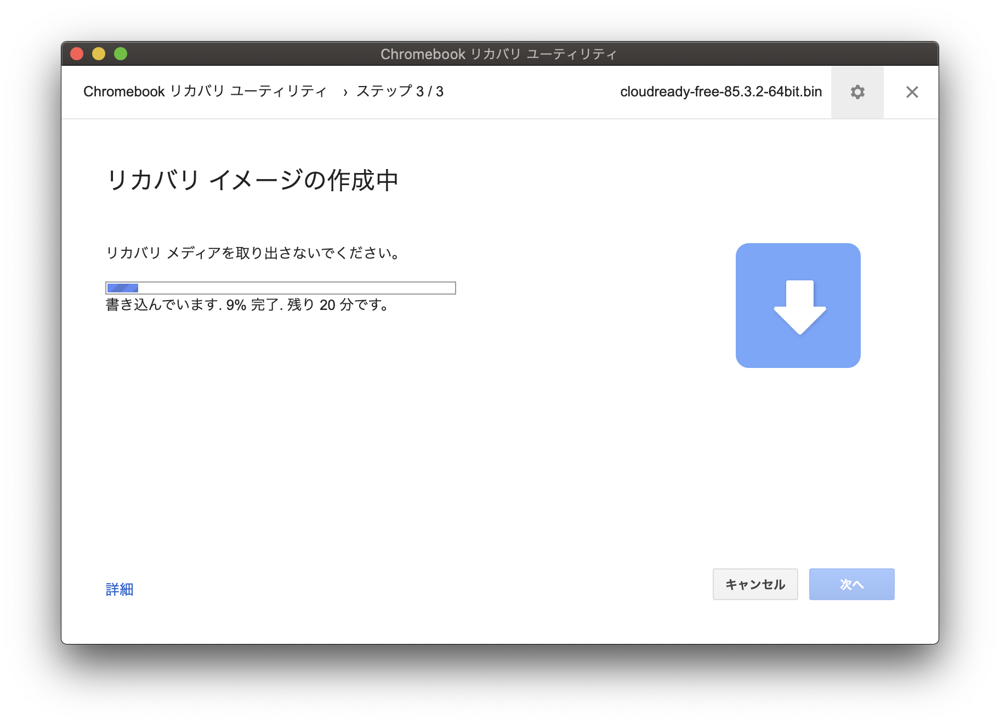
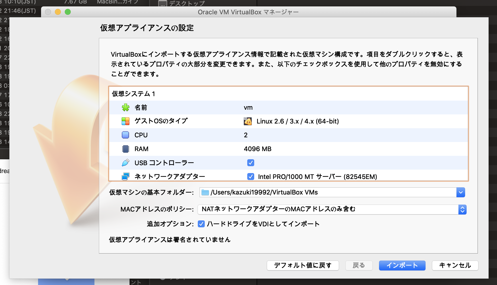

# こんにちは！
こんにちは！！！(クソでか挨拶)  
(Zennでは)初投稿です。  
CloudreadyというChromiumOSをmacOS上のVMで動かすときに少しだけ躓いたのでメモです

# 1. Cloudreadyのダウンロード
まず、[Cloudreadyのサイト](https://www.neverware.com/freedownload#home-edition-install)にアクセスして、真ん中くらいのところにある`Create a USB Installer manually`のところの`DOWNLOAD 64-BIT IMAGE`をクリックしましょう。

そうすると、`cloudready-free-XX.X.X-64bit.zip`がダウンロードされます！！  
ダウンロードが完了したら展開しましょう。binファイルが得られるはずです。

<!-- # 2. 空のisoイメージの作成
次に、ディスクユーティリティを開きます。  
開いたら`ファイル -> 新規イメージ -> 空のイメージを作成`でイメージを作成しましょう

このとき、isoイメージにしたいので、イメージフォーマットは"CD/DVD"を選んでおくと良さそうです！  
サイズは一番大きな8.3GBにしましょう！大きいね！  

## 2-1. 設定項目
- 名前: Finderで表示される名前 後から自由に変更可能
- サイズ: とりあえず一番大きな8.3GB
- パーディション: CD/DVD
- イメージフォーマット: DVD/CDマスター

拡張子がisoじゃないことに違和感をおぼえるかもですが、いったんcdr形式で保存しましょう！(isoに書き直して保存しようとしたらできなかったので)

作成したディスクイメージがマウントされていたらマウント解除してください！  
次に、拡張子をisoに書き換えます！

こんな感じの警告が出ますが`".iso"を使用`を押してください！ -->

# 2. ダウンロードしたbinファイルをisoに変換する
**この項目では中身を消し飛ばしても問題ない8GB以上のUSBメモリが必要です！**  
Chrome拡張機能の`Chromebook リカバリ ユーティリティ`が必要なので、Chrome Web Storeからインストールしておいてください！

